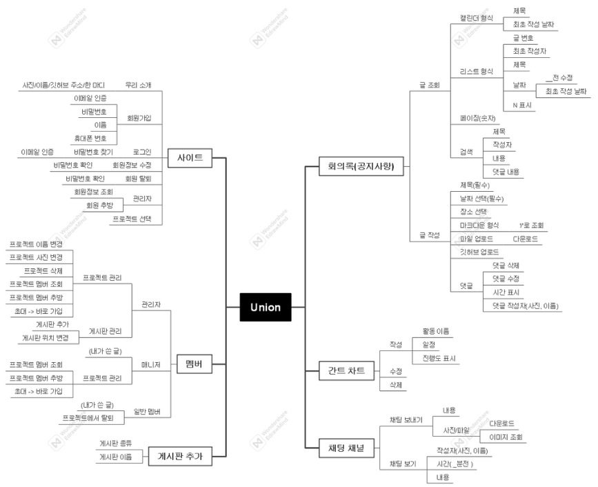
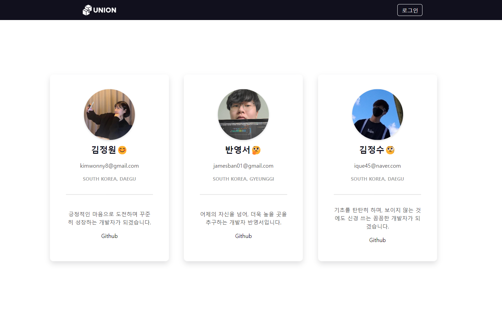
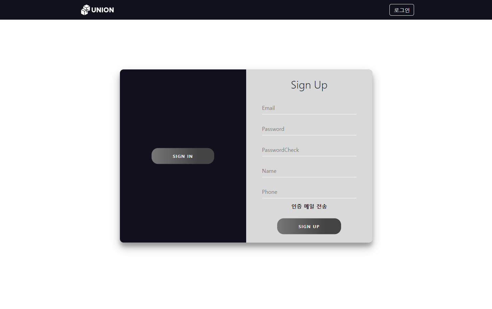
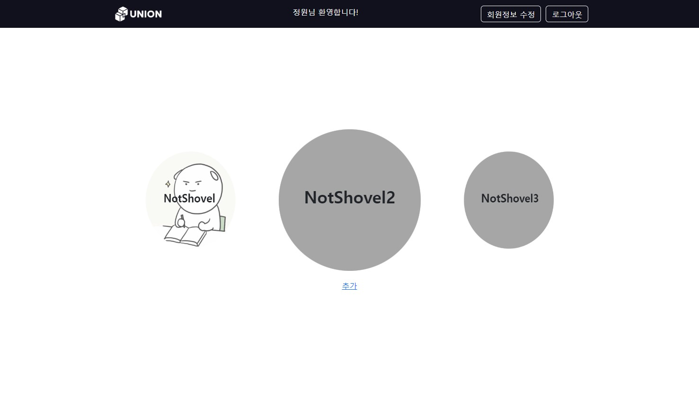

# NotShovel-Union
<br> 

## 👩‍💻 NotShovel 팀원 소개
<table>
  <tbody>
    <tr>
      <td align="center"><a href="https://github.com/kimwonny8"><br /><sub><b>팀장 : 김정원 </b></sub></a><br /></td>
      <td align="center"><a href="https://github.com/bys096"><br /><sub><b>팀원 : 반영서</b></sub></a><br /></td>
      <td align="center"><a href="https://github.com/YJU-KimJeongSu"><br /><sub><b>팀원 : 김정수</b></sub></a><br /></td>
     </tr>
  </tbody>
</table>

<br> 


## ⏰ 진행 기간

- 기획 : 1월 26일 ~ 3월 
- 개발 : 3월 28일 ~ 6월 21일 

<br>

## 🖥️ 사용 기술

```
Mac, Window, Visual Studio Code

Vue.js 2, HTML, CSS, JavaScript, Axios

Node.js 18, Mongoose 7, WebSocket, WebToken

MongoDB

Git, Github, Github Desktop, Collabee, Discord, AWS, Vercel
```

<br>

## 📌 기획 배경 및 진행

- 여러 사람들과 협업하는 것에 더 익숙해지고 싶어서 자발적으로 다른 친구들을 모아 팀을 조직하게 되었고, 팀원들 각자 원하는 분야에 대해 조금 더 공부하는 것을 목표로 진행한 프로젝트입니다.

- 온라인으로 프로젝트 회의를 진행할 때, 실시간으로 다 같이 회의록이 작성되는 걸 보며 채팅을 할 수 있으면 좋을 것 같아 해당 주제로 프로젝트를 진행하게 되었습니다.

- 스프린트 기간을 1주일로 잡고 주 1회는 꼭 모여서 회고를 하며 향후 일정, 계획을 세웠습니다.

<br>

## 📌 기능

- 로그인/회원가입
  - 이메일 인증
  - 비밀번호 암호화
  - 토큰 발행
- 프로젝트 생성
  - 이미지 업로드(S3 - presigned url)
- 초대링크
  - 링크 복사
  - 해당 프로젝트로 자동가입
- 회의록(공지사항)
  - 마크다운 에디터
  - 실시간 작성 공유, 실시간 채팅
- 간트차트
- 전체 채팅


<br> 

## 📌 마인드맵



<br>

## 📖 실행화면

<details>
<summary>보기</summary>
<div markdown="1">


### 토큰 발급 및 요청 횟수 제한

- 토큰을 발급하여 권한이 있는 사람만 접근할 수 있게 하였고, 1분에 20번으로 요청 횟수를 제한했습니다.


### 로그인 전 메인화면



### 회원가입 및 로그인




### 프로젝트 생성


### 프로젝트 생성 후 초대링크로 초대 가능




### 프로젝트에 들어왔을 때, 게시판 추가 화면


### 회의록

- 회의록 작성 중인 모습이며 해당 페이지는 웹소켓을 이용해 실시간 공유되며, 채팅을 할 수 있습니다.


### 간트차트

- 간트차트에 시작일, 기간, 내용을 입력할 수 있습니다.


### 설정

- 프로젝트 삭제와 수정, 회원 관리가 가능하며 매니저는 회원 관리만 할 수 있습니다.


</div>
</details>
